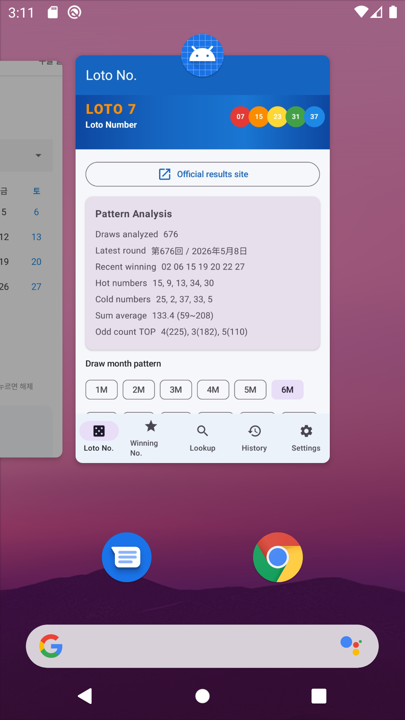
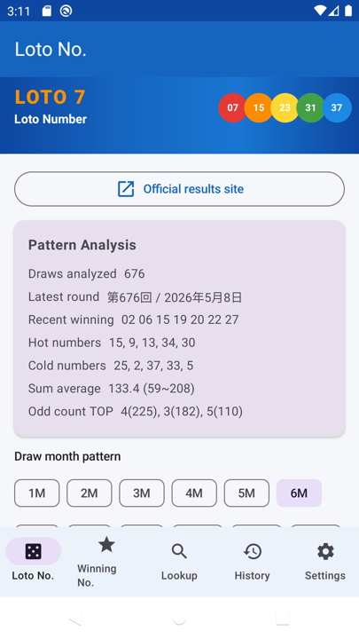

# Loto Number (ロト番号)

> **Manuals:** [English](README.md) · [한국어](README_KO.md) · [日本語](README_JP.md)

User and developer manual for the **Loto Number** Android app and Python CLI — pattern analysis and auto-generation for Japanese **Loto7**.

> **App name:** ロト番号  
> **Version:** 1.4  
> **Package:** `com.lotto7.generator`  
> **Repository:** https://github.com/xiger78/LottoNumber

---

## 1. Overview

**Loto Number** analyzes **680** past Loto7 main-number draws and generates 10 weighted random combinations based on statistical patterns.

| Item | Details |
|------|---------|
| Lottery | Japanese Loto7 (pick 7 numbers from 1–37) |
| Data source | `ロ또7.xlsx` → `assets/draws.json` |
| Default UI language | Japanese |
| Supported languages | 日本語 / 한국어 / English |
| APK download | [releases/loto-number-v1.4.apk](releases/loto-number-v1.4.apk) (signed release) |
| Build | Release `assembleRelease` / Debug `assembleDebug` |

---

## 2. Screen Layout

A **LOTO 7 banner** is always shown below the top bar. Five menus are available from the bottom navigation.

```
┌─────────────────────────────┐
│  TopBar (menu title)        │
├─────────────────────────────┤
│  ★ LOTO 7 Banner            │
├─────────────────────────────┤
│                             │
│  Menu content               │
│                             │
├─────────────────────────────┤
│ Loto│Win │Lookup│Hist│Set  │
└─────────────────────────────┘
```

---

## 3. Menu Guide

### 3.1 Loto Numbers (ロト番号)

Main screen: analyzes Excel draw data and auto-generates numbers.

**Features**

- Pattern analysis over **680 draws** (frequency, kou distribution, odd/even, sum)
- **Monthly pattern** selection (Jan–Dec) — weights numbers by draw month
- **Generate 10 sets** — weighted random + pattern filters
- **Saved winning numbers** — recent winners get lower weight; numbers not in saved draws get a boost
- Link to [Mizuho Bank Loto7 official results](https://www.mizuhobank.co.jp/takarakuji/check/loto/loto7/index.html)


---

### 3.2 Winning Numbers (当選数字)

View, register, edit, and delete winning main numbers. **Latest draw data is synced automatically.** Saved entries feed into the generation algorithm.

**Auto-sync (v1.4)**

- **On app start** — imports missing rounds from embedded `draws.json` (680) and fetches newer draws from the official site
- **When opening this tab** — re-checks and updates any missing rounds
- Sorted by **round descending** (第680回 → 第679回 …), with **Total N draws** at the top
- **Progress bar** while syncing

> You do not need to tap **Auto-register** in Settings for data to appear here.

**Manual entry**

- **Add (+)** — round, draw date, 7 main numbers (1–37)
- **Edit / Delete** — with confirmation
- Stored permanently in Room DB

**Input example**

```
Round: 第677回
Date:  2026年6月13日
Numbers: 01 05 12 17 23 28 34
```


---

### 3.3 Winning Lookup (当選照会)

Browse past winning main numbers from embedded draw data (**680 draws**).

**Features**

- Search by round label or date
- Newest first, **10 entries per page**
- Previous / Next pagination


---

### 3.4 Generation History (生成履歴)

History of auto-generated number sets.

**Display format (English)**

`2026/06/11 14:30:01 02 03 04 05 06 07`

- Sorted by datetime **descending**
- **10 items per page**



---

### 3.5 Settings (設定)

Language and data import options.

**Display languages**

1. **日本語** (default)
2. **한국어**
3. **English**

**Import buttons**

| Button | Action |
|--------|--------|
| **Auto-register main numbers** | Register missing draws from embedded data (680), then fetch newer rounds after the latest embedded draw from the official site |
| **Fetch from official site** | Fetch latest results from Mizuho Bank and register (requires network; may fail if blocked) |

**Auto-register behavior**

- Progress and result (e.g. *Added 4 / Skipped 676*) are shown in a **banner at the top** of Settings
- Step 1: import missing rounds from embedded `draws.json`
- Step 2: check the official site for any draws after the latest embedded round

> If the official site blocks the request, embedded auto-register still works for rounds included in `draws.json`.



---

## 4. Number Generation Algorithm

```
1. Build per-number weights from 680 draws + saved winning numbers
2. Add monthly pattern weights
3. Pick 7 numbers by weighted random
4. Apply pattern filters:
   - Kou distribution (1–7 / 8–14 / 15–21 / 22–28 / 29–37)
   - Odd count (3–4 most common)
   - Sum range (mean ± 1.8σ)
   - Exclude combos overlapping saved wins by 5+ numbers
5. Output 10 unique sets → saved to Generation History
```

> For entertainment and reference only. **No guarantee of winning.**

---

## 5. Python CLI

```bash
python3 -m venv .venv
source .venv/bin/activate
pip install -r requirements.txt
python lotto7_generator.py
```

Export Excel to Android JSON:

```bash
python android/export_draws.py
```

---

## 6. Development Environment

### 6.1 Required tools

| Tool | Version |
|------|---------|
| OS | macOS / Windows / Linux |
| JDK | OpenJDK **17+** |
| Android Studio | Hedgehog (2023.1.1)+ recommended |
| Android SDK | API **34** |
| Gradle | 8.2 |
| Kotlin | 1.9.22 |
| Python (export) | 3.7+ |

### 6.2 Build

**Release (recommended)**

```bash
export JAVA_HOME="/usr/local/opt/openjdk@17/libexec/openjdk.jdk/Contents/Home"
cd android
cp keystore.properties.example keystore.properties   # set keystore path and passwords
./gradlew assembleRelease
```

Output: `android/app/build/outputs/apk/release/app-release.apk`  
Signed release builds are published as `releases/loto-number-v1.4.apk`.

**Debug**

```bash
export JAVA_HOME="/usr/local/opt/openjdk@17/libexec/openjdk.jdk/Contents/Home"
cd android
./gradlew assembleDebug
```

Output: `android/app/build/outputs/apk/debug/app-debug.apk`

---

## 7. Tech Stack

### Android

| Category | Library | Version |
|----------|---------|---------|
| Language | Kotlin | 1.9.22 |
| UI | Jetpack Compose + Material3 | BOM 2024.02.00 |
| Architecture | ViewModel + StateFlow | lifecycle 2.7.0 |
| Database | Room | 2.6.1 |
| Preferences | DataStore | 1.0.0 |
| Async | Kotlin Coroutines | 1.7.3 |
| Navigation | Navigation Compose | 2.7.7 |
| Build | AGP | 8.2.2 |
| Code gen | KSP | 1.9.22-1.0.17 |

### Python CLI

| Library | Purpose |
|---------|---------|
| pandas | Read Excel data |
| openpyxl | Parse .xlsx |

### Project structure

```
LottoNumber/
├── README.md              # This manual (English)
├── README_KO.md           # Korean manual
├── README_JP.md           # Japanese manual
├── 로또7.xlsx             # Source draw data
├── lotto7_generator.py    # Python CLI
├── requirements.txt
├── docs/images/           # Screenshots (en/, ko/, ja/)
├── releases/              # APK files (loto-number-v1.4.apk, etc.)
└── android/               # Android app source
    └── keystore.properties.example  # Release signing template
```

---

## 8. Changelog

### v1.4

- **Winning Numbers** auto-sync on app start and when opening the tab (680 draws, newest first)
- Signed **release APK** build (`assembleRelease`)

### v1.3.1

- **Auto-register UX fix** — result banner at top of Settings, clearer “already registered” message, faster import
- Progress text while registering embedded data and checking the official site

### v1.3

- Embedded draw data extended to **680 rounds** (677–680)
- **Auto-register** also fetches missing rounds after the latest embedded draw from the official site

### v1.2

- **Winning Lookup** screen (676 past draws, search, pagination)
- Settings: **Auto-register from Excel** and **Fetch from official site**
- 5 bottom navigation menus

### v1.1

- Top **LOTO 7 banner**
- Manual with screenshots; dev environment docs

### v1.0

- Initial release: 4 menus, pattern analysis, i18n, GitHub

---

## 9. Disclaimer

This tool uses historical draw statistics for **entertainment and reference only**. It does not guarantee wins or improve odds in any scientifically proven way.
