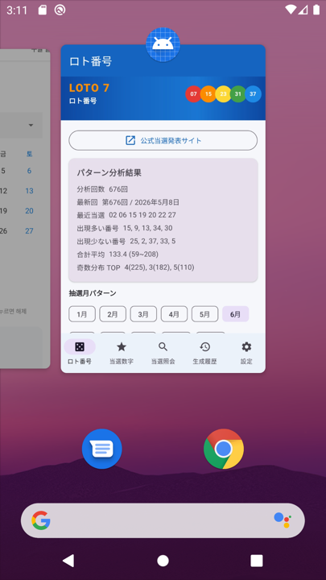
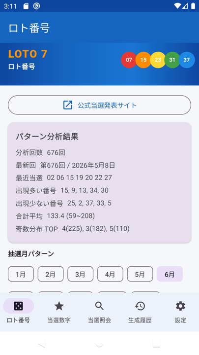

# ロト番号 (Loto Number)

> **マニュアル:** [English](README.md) · [한국어](README_KO.md) · [日本語](README_JP.md)

日本 **ロト7 (Loto7)** 本数字パターン分析・自動生成 — React Native アプリの使用・開発マニュアル

> **アプリ名:** ロト番号  
> **バージョン:** 1.4  
> **パッケージ:** `com.lotto7.generator`  
> **リポジトリ:** https://github.com/xiger78/LottoNumber

---

## 1. アプリ概要

**ロト番号**は、ロト7の過去本数字 **680回** のデータを分析し、統計パターンに基づいて番号10組を自動生成する React Native アプリです。

| 項目 | 内容 |
|------|------|
| 対象くじ | 日本ロト7（1〜37から7個選択） |
| データ元 | `assets/draws.json`（680回内蔵） |
| デフォルト言語 | 日本語 |
| 対応言語 | 日本語 / 한국어 / English |
| プラットフォーム | React Native (Expo) — iOS & Android |

---

## 2. 画面構成

TopBar の下に **LOTO 7 バナー** が常に表示されます。  
下部ナビゲーションで **5つのメニュー** を切り替えます。

```
┌─────────────────────────────┐
│  TopBar（メニュー名）         │
├─────────────────────────────┤
│  ★ LOTO 7 バナー            │
├─────────────────────────────┤
│                             │
│  各メニューの内容            │
│                             │
├─────────────────────────────┤
│ロト│当選│照会│履歴│設定     │
└─────────────────────────────┘
```

---

## 3. メニュー別機能

### 3.1 ロト番号

エクセル本数字データを分析し、番号を自動生成するメイン画面です。

**主な機能**

- **680回** の過去抽選データ分析（出現頻度、口分布、奇偶、合計）
- **抽選月パターン** 選択（1〜12月）— 該当月の出現頻度を反映
- **番号10組生成** — 加重ランダム + パターンフィルタ
- **登録済み当選数字の反映** — 最近の当選番号は重み減、未出現番号は重み増
- [みずほ銀行 ロト7 公式当選発表](https://www.mizuhobank.co.jp/takarakuji/check/loto/loto7/index.html) へのリンク


---

### 3.2 当選数字

発表された当選本数字を登録・修正・削除し、**最新抽選データを自動更新**する画面です。  
登録データは **ロト番号** メニューの生成アルゴリズムに自動反映されます。

**自動更新（v1.4）**

- **アプリ起動時** — 内蔵 `draws.json`（680回）と公式サイトの最新回を当選数字DBへ自動登録
- **当選数字タブ表示時** — 未登録分を再確認・更新
- **回別降順** 表示（第680回 → 第679回 …）、上部に **合計 N回** を表示
- 更新中は上部に **進捗バー** を表示

> 設定の **本数字自動登録** を押さなくても、この画面に最新データが表示されます。

**手動入力**

- **追加 (+)** — 回別、抽せん日、本数字7個を入力
- **修正 / 削除** — 確認後に削除
- Room DB に永続保存

**入力例**

```
回別: 第677回
抽せん日: 2026年6月13日
本数字: 01 05 12 17 23 28 34
```


---

### 3.3 当選照会

内蔵抽選データ（**680回**）の過去当選本数字を照会する画面です。

**主な機能**

- **回別・日付で検索**
- **新しい順** に表示
- **10件ずつ** ページ送り（前へ / 次へ）


---

### 3.4 生成履歴

自動生成した番号の履歴を確認する画面です。

**表示形式（日本語）**

`2026年06月11日14時30分:01 02 03 04 05 06 07`

**機能**

- **日時降順** ソート
- **10件ずつ** ページ表示



---

### 3.5 設定

表示言語および当選数字の自動登録機能を提供します。

**表示言語**

1. **日本語**（デフォルト）
2. **한국어**
3. **English**

**自動登録ボタン**

| ボタン | 機能 |
|--------|------|
| **本数字自動登録** | 内蔵データ（680回）の **未登録分** を登録後、最新内蔵回以降は公式サイトから追加取得 |
| **公式サイトから取得** | みずほ銀行当選発表ページから **最新番号** を取得・登録（ネットワーク必要） |

**本数字自動登録の動作**

- 設定画面 **上部バナー** に進捗と結果を表示（例: `登録 4件 / スキップ 676件`）
- ステップ1: `draws.json` 内蔵データの未登録分を一括登録
- ステップ2: 内蔵最新回（680回）以降を公式サイトで追加確認

> 公式サイトはボット遮断で失敗する場合があります。内蔵データに含まれる回は **本数字自動登録** で登録できます。



---

## 4. 番号生成アルゴリズム

```
1. 内蔵680回 + 登録済み当選数字 → 番号別重み付け
2. 月別パターン重みを加算
3. 重み付きランダムで7個選択
4. パターンフィルタ適用
   - 口分布（1〜7 / 8〜14 / 15〜21 / 22〜28 / 29〜37）
   - 奇数個数（3〜4個が最多）
   - 合計範囲（平均 ± 1.8σ）
   - 登録済み当選と5個以上一致する組み合わせは除外
5. 10組生成 → 生成履歴に自動保存
```

> ※ 過去パターン参考用。**当選を保証しません。**

---

## 5. 開発環境

### 5.1 必要ツール

| ツール | バージョン |
|--------|-----------|
| **Node.js** | 18+ |
| **Expo** | `npx expo` |
| **iOS** | Xcode（macOS） |
| **Android** | Android Studio / SDK |

### 5.2 実行

```bash
npm install
npx expo start
```

`a` — Android エミュレータ、`i` — iOS シミュレータ、QR — Expo Go

### 5.3 ビルド

```bash
npm install -g eas-cli
eas build --platform android
eas build --platform ios
```

---

## 6. 技術スタック

| 分類 | 技術 |
|------|------|
| フレームワーク | React Native + Expo |
| 言語 | TypeScript |
| ナビゲーション | React Navigation |
| ストレージ | AsyncStorage |
| データ | `assets/draws.json` |

### プロジェクト構成

```
LottoNumber/
├── App.tsx
├── assets/draws.json
├── src/engine/          # パターン分析・番号生成
├── src/data/            # ストレージ・公式サイト fetch
├── src/screens/         # 5タブ画面
├── src/i18n/            # 3言語
└── docs/images/
```

---

## 8. 変更履歴

### v1.4

- **当選数字** メニューを起動時・タブ表示時に自動同期（680回、新しい順）
- 署名付き **リリースAPK** ビルド（`assembleRelease`）

### v1.3.1

- **本数字自動登録 UX 改善** — 設定画面上部に結果バナー、「登録済み」メッセージの明確化、登録速度向上
- 内蔵データ登録 / 公式サイト確認中の進捗表示

### v1.3

- 内蔵抽選データ **680回** に拡張（677〜680回追加）
- **本数字自動登録** で内蔵最新回以降を公式サイトから追加取得

### v1.2

- **当選照会** 画面追加（676回、検索、ページング）
- 設定: **本数字自動登録**、**公式サイトから取得**
- 下部メニュー5構成

### v1.1

- 上部 **LOTO 7 バナー** 追加
- マニュアル・画面キャプチャ文書

### v1.0

- 初回リリース：4メニュー、676回分析、3言語、GitHub登録

---

## 9. 免責事項

本アプリは過去の抽選データの統計パターンを参考に番号を生成する **娯楽・参考用** ツールです。  
当選を保証したり、当選確率を科学的に高めるものではありません。
