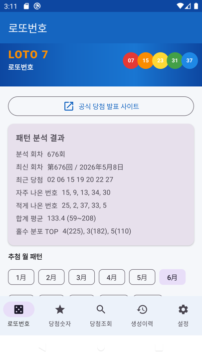
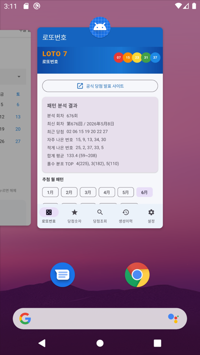

# 로또번호 (ロト番号)

> **메뉴얼:** [English](README.md) · [한국어](README_KO.md) · [日本語](README_JP.md)

일본 **로또7(Loto7)** 본숫자 패턴 분석 및 자동 생성 — Android 앱 및 Python CLI 사용·개발 메뉴얼

> **앱 이름:** ロト番号 (일본어 표기)  
> **버전:** 1.2  
> **패키지:** `com.lotto7.generator`  
> **저장소:** https://github.com/xiger78/LottoNumber

---

## 1. 앱 개요

**ロト番号**는 일본 로또7의 과거 본숫자 **676회** 데이터를 분석하여, 통계 패턴 기반으로 번호 10조합을 자동 생성하는 Android 앱입니다.

| 항목 | 내용 |
|------|------|
| 대상 복권 | 일본 Loto7 (1~37번 중 7개 선택) |
| 데이터 출처 | `ロ또7.xlsx` → `assets/draws.json` |
| 기본 표시 언어 | 일본어 (日本語) |
| 지원 언어 | 日本語 / 한국어 / English |
| APK 다운로드 | [releases/loto-number-v1.2-debug.apk](releases/loto-number-v1.2-debug.apk) |

---

## 2. 화면 구성

TopBar 아래에 **LOTO 7 배너**가 항상 표시됩니다.  
하단 네비게이션으로 **5개 메뉴**를 전환합니다.

```
┌─────────────────────────────┐
│  TopBar (메뉴명)             │
├─────────────────────────────┤
│  ★ 로또 배너 (LOTO 7)        │
├─────────────────────────────┤
│                             │
│  각 메뉴 콘텐츠              │
│                             │
├─────────────────────────────┤
│로또│당첨│조회│이력│설정      │
└─────────────────────────────┘
```

---

## 3. 메뉴별 기능 설명

### 3.1 ロト番号 (로또번호)

엑셀 본숫자 데이터를 분석하여 번호를 자동 생성하는 메인 화면입니다.

**주요 기능**

- **676회** 과거 추첨 데이터 패턴 분석 (빈도, 口 분포, 홀짝, 합계)
- **월별 패턴** 선택 (1~12月) — 해당 월 출현 빈도 반영
- **번호 10조합 생성** — 가중치 랜덤 + 패턴 필터 적용
- **저장된 당첨숫자 반영** — 최근 당첨 번호 가중치 감소, 미출현 번호 가중치 증가
- **공식 당첨 발표 사이트** 링크 → [みずほ銀行 Loto7](https://www.mizuhobank.co.jp/takarakuji/check/loto/loto7/index.html)



---

### 3.2 当選数字 (당첨숫자)

발표된 당첨 본숫자를 직접 등록·수정·삭제하는 화면입니다.  
등록된 번호는 **ロト番号** 메뉴의 생성 알고리즘에 자동 반영됩니다.

**주요 기능**

- **추가 (+)** — 회차, 추첨일, 본숫자 7개 입력
- **수정 / 삭제** — 확인 후 삭제
- Room DB에 영구 저장

**입력 형식 예시**

```
회차: 第677回
추첨일: 2026年6月13日
본숫자: 01 05 12 17 23 28 34
```


---

### 3.3 当選照会 (당첨번호 조회)

엑셀에 포함된 과거 당첨 본숫자(**676회**)를 조회하는 화면입니다.

**주요 기능**

- **회차·날짜 검색**
- **최신순** 정렬
- **10건씩** 페이지 이동 (이전 / 다음)


---

### 3.4 生成履歴 (생성이력)

자동 생성한 로또 번호의 이력을 확인하는 화면입니다.

**표시 형식 (한국어)**

`2026년06월11일14시30분:01 02 03 04 05 06 07`

**기능**

- **일시 내림차순** 정렬 (최신순)
- **10건씩** 페이지 단위 표시



---

### 3.5 設定 (설정)

표시 언어 및 당첨번호 자동 등록 기능을 제공합니다.

**표시 언어**

1. **日本語** (기본)
2. **한국어**
3. **English**

**자동 등록 버튼**

| 버튼 | 기능 |
|------|------|
| **본숫자 자동등록** | 내장 엑셀 데이터(676회)에서 **미등록분**을 당첨숫자 DB에 일괄 등록 |
| **공식 사이트에서 가져오기** | みずほ銀行 당첨 발표 페이지에서 **최신 번호**를 가져와 등록 (네트워크 필요) |

> 공식 사이트는 봇 차단으로 실패할 수 있습니다. 실패 시 **본숫자 자동등록**을 사용하세요.


---

## 4. 번호 생성 알고리즘

```
1. 엑셀 676회 + 저장된 당첨숫자 → 번호별 가중치 계산
2. 월별 패턴 가중치 추가
3. 가중치 랜덤으로 7개 번호 선택
4. 패턴 필터 적용
   - 口 분포 (1~7 / 8~14 / 15~21 / 22~28 / 29~37)
   - 홀수 개수 (3~4개가 가장 많음)
   - 합계 범위 (평균 ± 1.8σ)
   - 저장된 당첨 조합과 5개 이상 겹치면 제외
5. 10조합 생성 → 생성이력에 자동 저장
```

> ※ 과거 패턴 기반 **참고용**이며 당첨을 보장하지 않습니다.

---

## 5. Python CLI

```bash
python3 -m venv .venv
source .venv/bin/activate
pip install -r requirements.txt
python lotto7_generator.py
```

엑셀 → Android JSON 변환:

```bash
python android/export_draws.py
```

---

## 6. 개발 환경

### 6.1 필수 도구

| 도구 | 버전 |
|------|------|
| **OS** | macOS / Windows / Linux |
| **JDK** | OpenJDK **17** 이상 |
| **Android Studio** | Hedgehog (2023.1.1) 이상 권장 |
| **Android SDK** | API **34** |
| **Gradle** | 8.2 |
| **Kotlin** | 1.9.22 |
| **Python** | 3.7+ |

### 6.2 빌드

```bash
export JAVA_HOME="/usr/local/opt/openjdk@17/libexec/openjdk.jdk/Contents/Home"
cd android
./gradlew assembleDebug
```

**APK 출력:** `android/app/build/outputs/apk/debug/app-debug.apk`

---

## 7. 기술 스택 및 라이브러리

### Android 앱

| 분류 | 기술 / 라이브러리 | 버전 |
|------|-------------------|------|
| 언어 | **Kotlin** | 1.9.22 |
| UI | **Jetpack Compose** + Material3 | BOM 2024.02.00 |
| 아키텍처 | ViewModel + StateFlow | lifecycle 2.7.0 |
| DB | **Room** | 2.6.1 |
| 설정 저장 | **DataStore Preferences** | 1.0.0 |
| 비동기 | **Kotlin Coroutines** | 1.7.3 |
| 네비게이션 | Navigation Compose | 2.7.7 |
| 빌드 | AGP | 8.2.2 |
| 코드 생성 | KSP | 1.9.22-1.0.17 |

### Python CLI

| 라이브러리 | 용도 |
|-----------|------|
| pandas | 엑셀 데이터 읽기 |
| openpyxl | .xlsx 파싱 |

### 프로젝트 구조

```
LottoNumber/
├── README.md              # 영어 메뉴얼
├── README_KO.md           # 한국어 메뉴얼 (본 문서)
├── README_JP.md           # 일본어 메뉴얼
├── 로또7.xlsx             # 원본 추첨 데이터
├── lotto7_generator.py    # Python CLI 생성기
├── docs/images/           # 화면 캡처 (en/, ko/, ja/)
├── releases/              # APK 파일
└── android/               # Android 앱 소스
```

---

## 8. 변경 이력

### v1.2

- **당첨번호 조회** 화면 추가 (676회, 검색, 페이지)
- 설정: **본숫자 자동등록**, **공식 사이트에서 가져오기**
- 하단 메뉴 5개 구성

### v1.1

- 상단 **LOTO 7 배너** 추가
- 메뉴얼 및 화면 캡처 문서

### v1.0

- 4개 메뉴, 676회 패턴 분석, 3개국어, GitHub 등록

---

## 9. 면책 조항

본 앱은 과거 추첨 데이터의 통계적 패턴을 참고하여 번호를 생성하는 **오락·참고용** 도구입니다.  
로또 당첨을 보장하거나 확률을 높인다는 과학적 근거는 없습니다.
