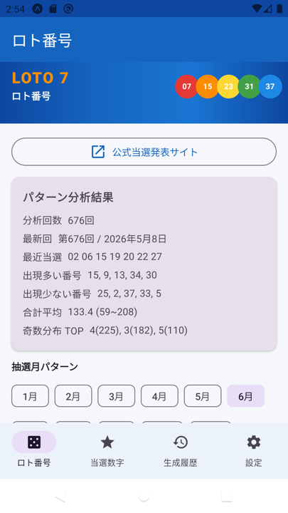
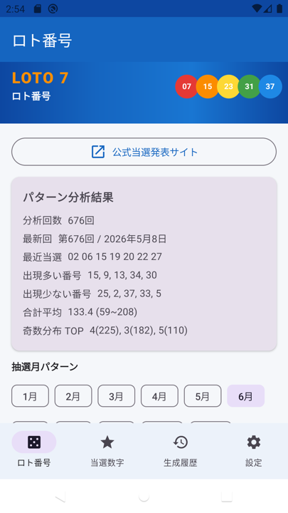
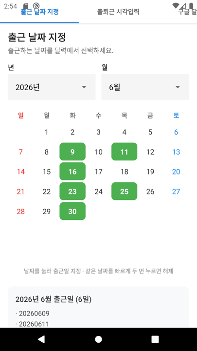
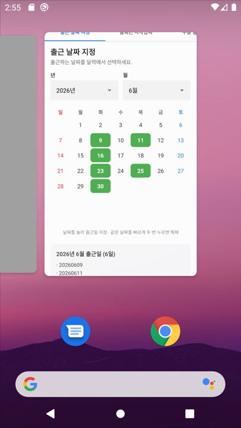

# ロト番号 (Lotto Number) 앱 사용 및 개발 메뉴얼

> **앱 이름:** ロト番号 (일본어)  
> **버전:** 1.1  
> **패키지:** `com.lotto7.generator`

---

## 1. 앱 개요

**ロト番号**는 일본 로또7(Loto7)의 과거 본숫자(676회) 데이터를 분석하여, 패턴 기반으로 번호 10조합을 자동 생성하는 Android 앱입니다.

| 항목 | 내용 |
|------|------|
| 대상 복권 | 일본 Loto7 (1~37번 중 7개 선택) |
| 데이터 출처 | `로또7.xlsx` → `assets/draws.json` |
| 기본 언어 | 일본語 (日本語) |
| 지원 언어 | 日本語 / 한국어 / English |

---

## 2. 화면 구성

앱 상단에는 **로또 배너(LOTO 7)** 가 항상 표시됩니다.  
하단 네비게이션으로 4개 메뉴를 전환합니다.

```
┌─────────────────────────────┐
│  TopBar (메뉴명)             │
├─────────────────────────────┤
│  ★ 로또 배너 (LOTO 7)        │
├─────────────────────────────┤
│                             │
│  각 메뉴 콘텐츠              │
│                             │
├─────────────────────────────┤
│ ロト番号 │当選数字│履歴│設定 │
└─────────────────────────────┘
```

---

## 3. 메뉴별 기능 설명

### 3.1 ロト番号 (로또번호)

엑셀 본숫자 데이터를 분석하여 번호를 자동 생성하는 메인 화면입니다.

**주요 기능**

- **676회** 과거 추첨 데이터 패턴 분석 (빈도, 口 분포, 홀짝, 합계)
- **월별 패턴** 선택 (1~12月) — 해당 월 출현 빈도 반영
- **번호 10조합 생성** — 가중치 랜덤 + 패턴 필터 적용
- **저장된 당첨숫자 반영** — 최근 당첨 번호 가중치 감소, 미출현 번호 가중치 증가
- **공식 당첨 발표 사이트** 링크 → [みずほ銀行 Loto7](https://www.mizuhobank.co.jp/takarakuji/check/loto/loto7/index.html)

**화면 캡처**



*패턴 분석 결과, 월 선택, 번호 생성 버튼, 추천 10조합 목록*

**번호 생성 후 화면**



---

### 3.2 当選数字 (당첨숫자)

발표된 당첨 본숫자를 직접 등록·수정·삭제하는 화면입니다.  
등록된 번호는 **ロト番号** 메뉴의 생성 알고리즘에 자동 반영됩니다.

**주요 기능**

- **추가 (+)** — 회차, 추첨일, 본숫자 7개 입력
- **수정** — 기존 항목 편집
- **삭제** — 확인 후 삭제
- Room DB에 영구 저장

**입력 형식 예시**

```
회차: 第677回
추첨일: 2026年6月13日
본숫자: 01 05 12 17 23 28 34
```

**화면 캡처**



---

### 3.3 生成履歴 (생성이력)

자동 생성한 로또 번호의 이력을 확인하는 화면입니다.

**표시 형식**

| 언어 | 형식 예시 |
|------|-----------|
| 日本語 | `2026年06月11日14時30分:01 02 03 04 05 06 07` |
| 한국어 | `2026년06월11일14시30분:01 02 03 04 05 06 07` |
| English | `2026/06/11 14:30:01 02 03 04 05 06 07` |

**기능**

- **일시 내림차순** 정렬 (최신순)
- **10건씩** 페이지 단위 표시
- 이전 / 다음 페이지 이동

**화면 캡처**


---

### 3.4 設定 (설정)

앱 표시 언어를 변경하는 화면입니다.

**지원 언어 (우선순위)**

1. **日本語** (기본)
2. **한국어**
3. **English**

언어 변경 시 앱 전체 UI가 즉시 반영됩니다.

**화면 캡처**



---

## 4. 번호 생성 알고리즘 요약

```
1. 엑셀 676회 + 저장된 당첨숫자 → 번호별 가중치 계산
2. 월별 패턴 가중치 추가
3. 가중치 랜덤으로 7개 번호 선택
4. 패턴 필터 적용
   - 口 분포 (1~7 / 8~14 / 15~21 / 22~28 / 29~37)
   - 홀수 개수 (3~4개가 가장 많음)
   - 합계 범위 (평균 ± 1.8σ)
   - 저장된 당첨 조합과 5개 이상 겹치면 제외
5. 10조합 생성 → 생성이력에 자동 저장
```

> ※ 과거 패턴 기반 참고용이며 **당첨을 보장하지 않습니다.**

---

## 5. 개발 환경

### 5.1 필수 도구

| 도구 | 버전 |
|------|------|
| **OS** | macOS / Windows / Linux |
| **JDK** | OpenJDK **17** 이상 |
| **Android Studio** | Hedgehog (2023.1.1) 이상 권장 |
| **Android SDK** | API **34** (compileSdk) |
| **Gradle** | 8.2 |
| **Kotlin** | 1.9.22 |

### 5.2 Python (데이터 변환용)

| 도구 | 버전 |
|------|------|
| **Python** | 3.7+ |
| **pandas** | ≥ 1.3.0 |
| **openpyxl** | ≥ 3.0.0 |

```bash
python3 -m venv .venv
source .venv/bin/activate
pip install -r requirements.txt
python android/export_draws.py   # 엑셀 → JSON 변환
```

### 5.3 빌드 명령

```bash
export JAVA_HOME="/usr/local/opt/openjdk@17/libexec/openjdk.jdk/Contents/Home"
cd android
./gradlew assembleDebug
```

**APK 출력 경로:** `android/app/build/outputs/apk/debug/app-debug.apk`

---

## 6. 기술 스택 및 라이브러리

### 6.1 Android 앱

| 분류 | 기술 / 라이브러리 | 버전 |
|------|-------------------|------|
| 언어 | **Kotlin** | 1.9.22 |
| UI | **Jetpack Compose** + Material3 | BOM 2024.02.00 |
| 아키텍처 | ViewModel + StateFlow | lifecycle 2.7.0 |
| DB | **Room** | 2.6.1 |
| 설정 저장 | **DataStore Preferences** | 1.0.0 |
| 비동기 | **Kotlin Coroutines** | 1.7.3 |
| 네비게이션 | Navigation Compose | 2.7.7 |
| 빌드 | AGP (Android Gradle Plugin) | 8.2.2 |
| 코드 생성 | KSP | 1.9.22-1.0.17 |

### 6.2 Python CLI

| 라이브러리 | 용도 |
|-----------|------|
| pandas | 엑셀 데이터 읽기 |
| openpyxl | .xlsx 파싱 |

### 6.3 프로젝트 구조

```
LottoNumber/
├── 로또7.xlsx                    # 원본 추첨 데이터
├── lotto7_generator.py           # Python CLI 생성기
├── requirements.txt
├── docs/
│   ├── MANUAL.md                 # 본 메뉴얼
│   └── images/                   # 화면 캡처
└── android/
    ├── app/src/main/
    │   ├── assets/draws.json     # 앱 내장 데이터
    │   └── java/com/lotto7/generator/
    │       ├── Lotto7Engine.kt   # 패턴 분석·생성
    │       ├── AppViewModel.kt   # 상태 관리
    │       ├── data/             # Room, DataStore
    │       ├── i18n/             # 다국어
    │       └── ui/               # Compose UI
    ├── export_draws.py           # 엑셀→JSON 변환
    └── build.gradle.kts
```

---

## 7. 변경 이력

### v1.1 (2026-06-11)

- 상단 **LOTO 7 로또 배너** 추가
- 메뉴별 사용 메뉴얼 및 화면 캡처 문서 작성
- 개발 환경·라이브러리 문서 추가

### v1.0 (2026-06-11)

- 4개 메뉴 (ロト番号 / 当選数字 / 生成履歴 / 設定) 구현
- 676회 패턴 분석 및 10조합 생성
- 당첨숫자 CRUD, 생성이력, 3개국어 지원
- GitHub 초기 등록

---

## 8. GitHub 저장소

https://github.com/xiger78/LottoNumber

---

## 9. 면책 조항

본 앱은 과거 추첨 데이터의 통계적 패턴을 참고하여 번호를 생성하는 **오락·참고용** 도구입니다.  
로또 당첨을 보장하거나 확률을 높인다는 과학적 근거는 없습니다.
